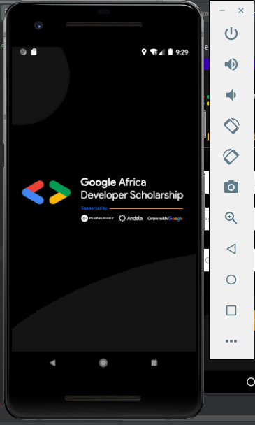
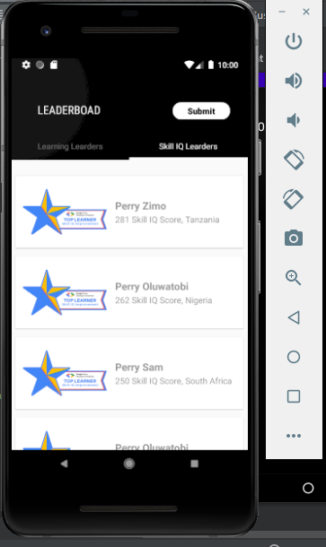
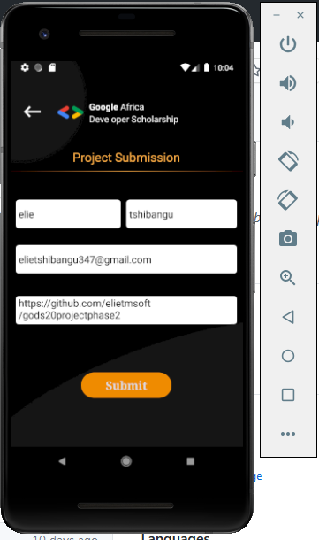
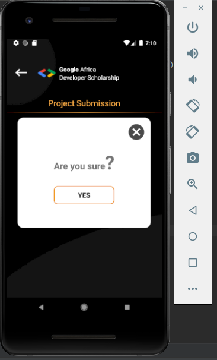
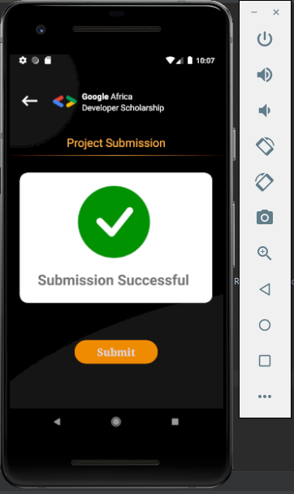
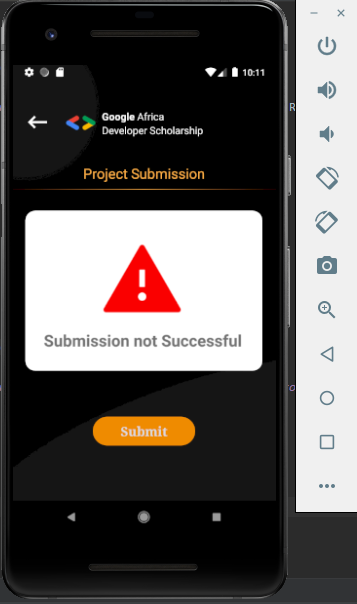

# GODS20 PROJECT PHASE 2

  -> the project consists of implementing the successful model as part of the Andella training

  -> List of gradle dependencies used to quickly get to the implementation of the project

<ul>
  <li>
     com.squareup.retrofit2:retrofit:2.4.0 et com.squareup.retrofit2:converter-gson:2.4.0 : To make http requests to our API and convert data to JSON
  </li>
   <li>
     com.squareup.picasso:picasso:2.5.2 : To transform a URL or character string into an image
  </li>
  <li>
     com.jaeger.statusbarutil:library:1.4.0 : To make the StatusBar transparent
  </li>
</ul>

  -> We have also sorted our lists based on either score or our hours

  
   
    
     
      
       
        

